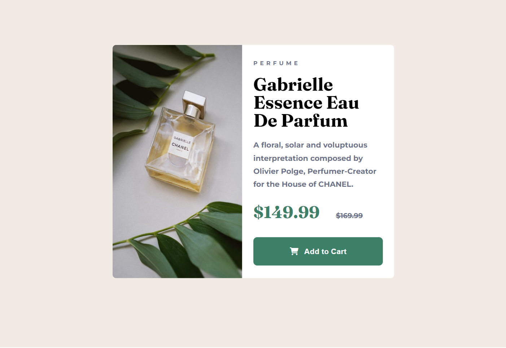

# Product preview card component

## Overview

- In this project i demonstrate my skills in creating visually captivating components while leveraging frontend development technologies.

### Screenshot

### Built with

- Semantic HTML5 markup
- CSS
- Flexbox
- CSS Grid
- Mobile-first work flow.
- Google fonts
- Font awesome

### What I learned

- I learned how to use css flexbox.

### Contributions

- Contributions are welcome! If you have any issues or have suggestions for improvements, please open an issue or submit a pull request.
